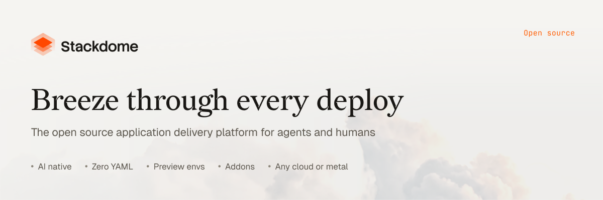
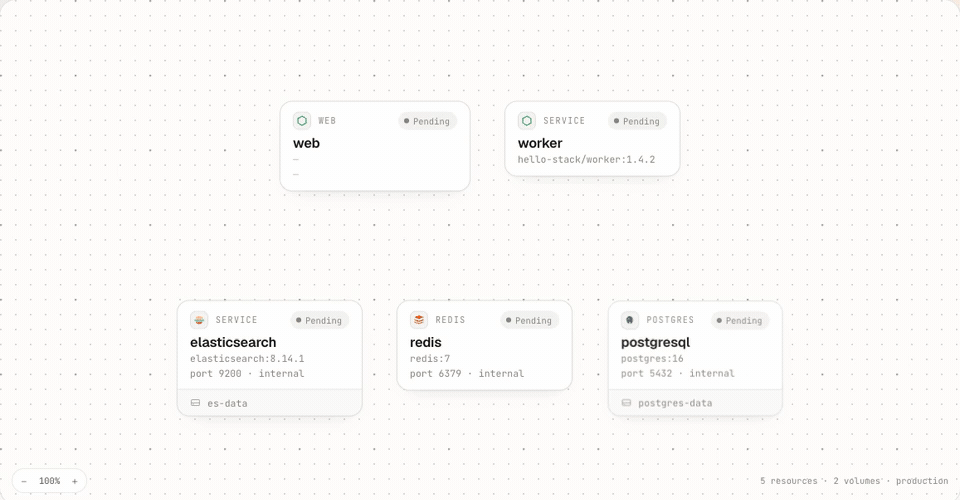

<p align="center">
  
</p>

<p align="center">
  Ship using agents, the Canvas, or the CLI. Self-host it, or run on our cloud.
</p>

<p align="center">
  <a href="https://docs.stackdome.com/quickstart">Quickstart</a> ·
  <a href="https://docs.stackdome.com">Docs</a> ·
  <a href="https://stackdome.com">Website</a> ·
  <a href="https://discord.gg/D97V6sFYqV">Discord</a>
</p>

<p align="center">
  <a href="https://github.com/Stackdome/stackdome/releases"></a>
  <a href="https://github.com/Stackdome/stackdome/actions/workflows/lint.yaml"></a>
  <a href="https://discord.gg/D97V6sFYqV"></a>
</p>

## What is Stackdome

Stackdome is an open-source, self-hostable alternative to Railway, Render, and Heroku.

Your whole application, described once and shipped as one unit: the services, the
databases, the storage they sit on. Stackdome takes it from a git push or a container
image to a live release.

The delivery layer comes with it: builds, managed Postgres with backups, TLS, a full
preview environment per branch, and a way back to any previous release. Drive it from
your coding agent, the Canvas, or the CLI, on our cloud or your own compute.

## Three ways in

One application model, three surfaces. Use whichever fits the moment.

### From your coding agent

Install the Stackdome skill, or point your agent at [agents.stackdome.com](https://agents.stackdome.com).
Your agent gets the full delivery loop: create stacks, deploy, tail releases, and debug from a prompt.

```bash
npx skills add stackdome/stackdome-skills
```

Then, in your agent:

> Deploy this repo to Stackdome and give me the live URL.

### From the Canvas

Compose services, databases, and volumes visually. Every change is a reviewable diff: apply,
deploy, and watch it go live.

<p align="center">
  
</p>

### From the CLI

Scaffold a stackfile, deploy, and watch the release converge. Then check status or open the live
app straight from the terminal.

```bash
curl -fsSL https://get.stackdome.com/cli.sh | sh
stackdome init
stackdome deploy --wait
stackdome status
stackdome open
```

## Features

- **Many services, one stack**: deploy an entire application as a single unit
- **Bring your own compute**: connect your clusters or start on a fresh VPS
- **Managed Postgres**: HA, automated backups, and point-in-time restore
- **Git to live app**: build from any git repo, or deploy any container image
- **Declarative in one file**: the whole stack in a reviewable `stackfile.yaml`
- **Every change is a diff**: releases are proven live and healthy before they count
- **Roll it back**: one command back to any previous release
- **Unlimited preview environments**: a full stack per branch or pull request
- **Any image registry**: public or private, or the built-in per-cluster registry
- **Observability built in**: live logs, metrics, and release timelines

## Get started

**Cloud (alpha):** [Start on the cloud](https://stackdome.com/signup). Alpha is open while capacity lasts.

**Self-host:**

```bash
curl -fsSL https://get.stackdome.com/install.sh | sudo sh
```

Runs on Kubernetes v1.27+ (EKS, GKE, AKS, k3s) or a fresh VPS with 2 vCPU / 4 GB.
Full walkthrough: [Self-host guide](https://docs.stackdome.com/self-host/install).

## Documentation

- [Quickstart](https://docs.stackdome.com/quickstart): first deploy in 10 minutes
- [Self-hosting](https://docs.stackdome.com/self-host/install)
- [Stackfile reference](https://docs.stackdome.com/reference/stackfile)
- [API reference](https://docs.stackdome.com/api-reference): generated from the repo's [OpenAPI spec](config/openapi/stackdome_api.yaml)

## Repositories

| Repo | What it is |
|------|------------|
| [stackdome](https://github.com/Stackdome/stackdome) | This repo, the hub: API server, web UI, and docs |
| [cluster-agent](https://github.com/Stackdome/cluster-agent) | Kubernetes operator that runs on each connected cluster |
| [stackdome-cli](https://github.com/Stackdome/stackdome-cli) | The `stackdome` command-line interface |

## Community & contributing

- [Discord](https://discord.gg/D97V6sFYqV): questions, feedback, launch chatter
- [Issues](https://github.com/Stackdome/stackdome/issues): bugs and feature requests
- [DEVELOPMENT.md](DEVELOPMENT.md): build and hack on Stackdome itself

